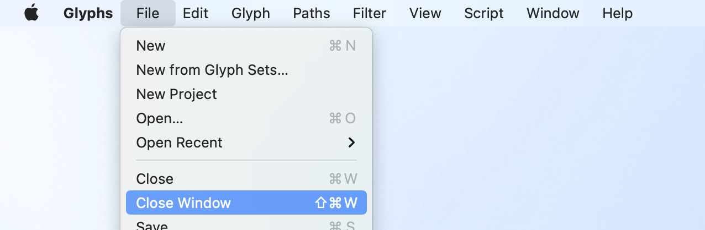

# Close Window

This is a plugin for the [Glyphs font editor](https://glyphsapp.com).

It adds a “Close Window” menu item to the file menu that closes the current font window.

## Preferences

Set `com.FlorianPircher.CloseWindow.retainKeyboardEquivalent` to true if you don’t want to reconfigure the menu item keyboard equivalents.

## Licenses

Plugin source code licensed under the [Apache License, Version 2.0](http://www.apache.org/licenses/LICENSE-2.0).

Plugin runner (`MacOS/Close Window`) copyright Georg Seifert (@schriftgestalt), Jan Gerner (@yanone), and Rainer Erich Scheichelbauer (@mekkablue); licensed under the [Apache License, Version 2.0](http://www.apache.org/licenses/LICENSE-2.0).
